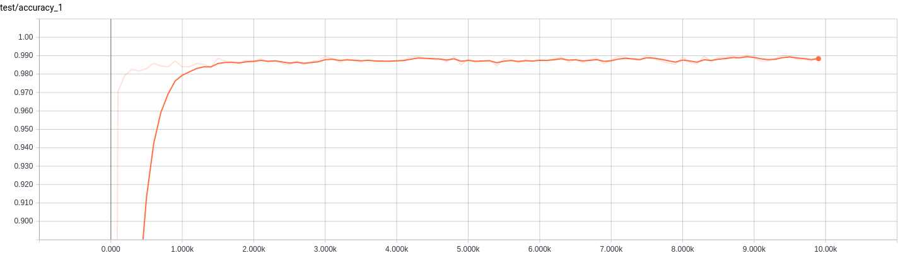

.. tf-lenet documentation master file, created by
   sphinx-quickstart on Wed Aug  9 09:29:33 2017.
   You can adapt this file completely to your liking, but it should at least
   contain the root `toctree` directive.

Lenet on TensorFlow
===================
 
Welcome to the Lenet tutorial using TensorFlow. 
From being a long time user of `Theano <https://github.com/Theano/Theano>`_, I am now migrating to `TensorFlow <https://www.tensorflow.org/>`_. 
This repository containing an implementation Lenet, the hello world of deep CNNs is my first implementation in TensorFlow.
It is a typical Lenet-5 network trained to classify MNIST dataset. 

.. image:: https://requires.io/github/ragavvenkatesan/tf-lenet/requirements.svg?branch=master
    :target: https://requires.io/github/ragavvenkatesan/tf-lenet/requirements/?branch=master
    :alt: Requirements Status

.. image:: https://img.shields.io/badge/license-MIT-blue.svg
   :target: license.html
   :alt: MIT License

.. image:: https://img.shields.io/badge/contributions-welcome-green.svg   
    :target: https://github.com/ragavvenkatesan/tf-lenet/
    :alt: Fork to contribute to the GitHub codebase

.. image:: https://readthedocs.org/projects/tf-lenet/badge/?version=latest
    :target: http://tf-lenet.readthedocs.io/en/latest/?badge=latest
    :alt: Documentation Status   

.. image:: https://badges.frapsoft.com/os/v1/open-source.svg?v=103
    :alt: Support Open Source

This is a simple code that can be found in the tutorial that comes with TensorFlow and most other public service tutorials.
I made mine a little modularized so that it could be re-purposed for other networks later.
This documentation website that comes along with this repository might help users migrating from theano to tensorflow, just as I did while 
implementing this repository. Whenever possible, I will make explicit comparisons to help along.

To begin with, it might be helpful to run the entire code in its default setting.
This will enable you to ensure that the installations were proper and that your machine was setup.

Obviously, you'd need `tensorflow <https://www.tensorflow.org/install/>`_ and `numpy <https://docs.scipy.org/doc/numpy/user/install.html>`_ installed.
There might be other tools that you'd require for advanced uses which you can find in the ``requirements.txt`` file that ships along with this code.  
Firstly, clone the repository down into some directory as follows,

.. code-block:: bash

    git clone http://github.com/ragavvenkatesan/tf-lenet
    cd tf-lenet

You can then run the entire code in one of two ways.
Either run the ``main.py`` file like so:

.. code-block:: python 

    python main.py

or type in the contents of that file, line-by-line in a python shell:

.. code-block:: python 

    from lenet.trainer import trainer
    from lenet.network import lenet5      
    from lenet.dataset import mnist

    dataset = mnist()   
    net = lenet5(images = dataset.images)  
    net.cook(labels = dataset.labels)
    bp = trainer (expert, dataset.feed)
    bp.train()

Once the code is running, setup tensorboard to observe results and outputs. 

.. code-block:: bash

    tensorboard --logdir=tensorboard

If everything went well, the tensorboard should have content populated in it.
Open a browser and enter the adress ``0.0.0.0:6006``, this will open up tensorboard.
The accuracy graph in the scalars tab under the test column will look like the following:

This implies that the network trained fully and has achieved about 99% accuracy and everything is normal.
From the next section onwards, I will go in detail, how I built this network. 

.. _tutorial: 

Tutorial
--------

The following is setup into various articles, each being its own guide. I recommend going through them in 
order although you should step ahead if some of the materials are familiar. Have fun! 

.. toctree::
   :maxdepth: 1
   :name: get_start   
   
   tutorial/intro
   tutorial/fc_layer
   tutorial/conv_layer
   tutorial/zbibiliography

.. toctree::
   :maxdepth: 3
   :name: hidden  
   :hidden:   

   api/index
   license