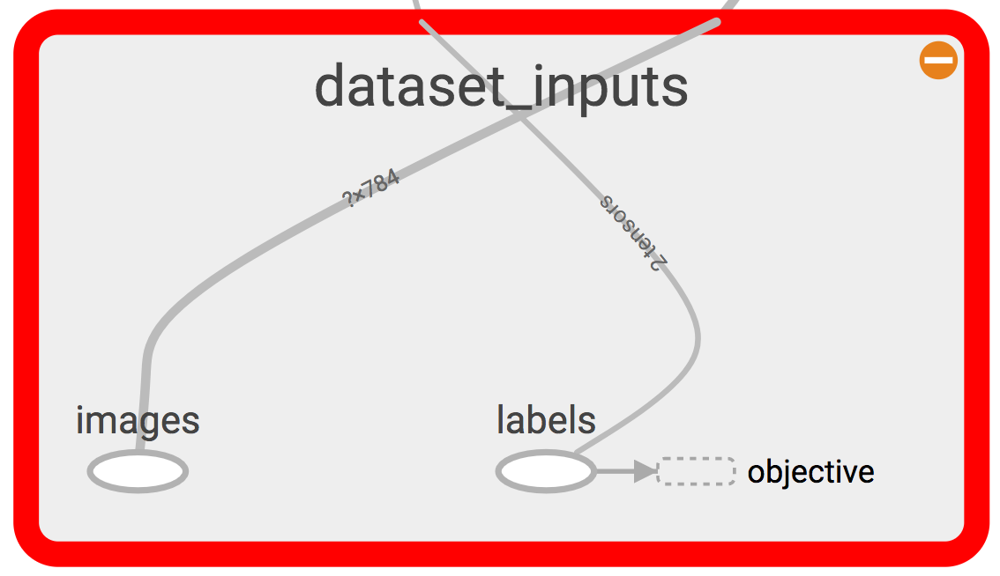
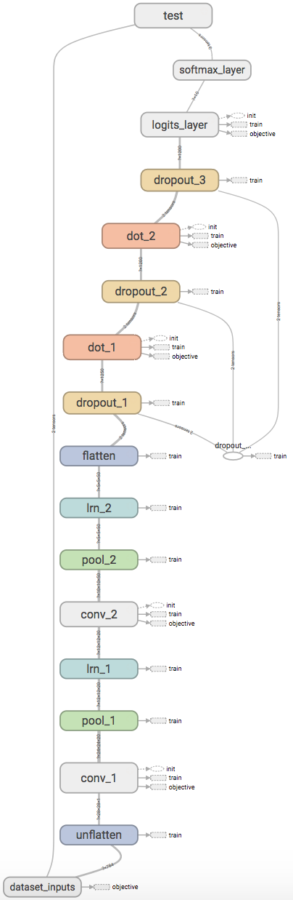

Network
=======

Now that we have seen all the layers, let us assemble our network together. 
Assembling the network together takes several steps and tricks and there isn't one way to do that.
To make things nice, clean and modular, let us use python class to structure the network class.
Before we even begin the network, we need to setup the dataset. 
We can then setup our network.

Dataset
-------

Tensorflow examples provides the MNIST dataset in a nice feeder-worthy form, which as a theano user,
I find very helpful. 
You can quite simply import this feeder as follows:

.. code-block:: python

    from tensorflow.examples.tutorials.mnist import input_data as mnist_feeder  

Using this, let us create a class that will not only host this feeder, but will also have some placeholders 
for labels and images.

.. code-block:: python

    def __init__ (self, dir = 'data'):
        self.feed = mnist_feeder.read_data_sets (dir, one_hot = True)

        #Placeholders
        with tf.variable_scope('dataset_inputs') as scope:
            self.images = tf.placeholder(tf.float32, shape=[None, 784], name = 'images')
            self.labels = tf.placeholder(tf.float32, shape = [None, 10], name = 'labels')

This now creates the following section of the graph:

   Dataset visualized in tensorboard. 

Network Architecture
---------------------

Before we begin building the network, Let us decide the architecture of the network.
Let us use the typical re-incarnated version of the modern lenet. 
Let us also fix this by using gloabl definitions (refer to them all in ``lenet.gloabl_definitions`` module).

.. code-block:: python

    # Some Global Defaults for Network
    C1 = 20     # Number of filters in first conv layer
    C2 = 50     # Number of filters in second conv layer
    D1 = 1200    # Number of neurons in first dot-product layer
    D2 = 1200    # Number of neurons in second dot-product layer
    C = 10      # Number of classes in the dataset to predict   
    F1 = (5,5)  # Size of the filters in the first conv layer
    F2 = (3,3)  # Size of the filters in the second conv layer
    DROPOUT_PROBABILITY = 0.5 # Probability to dropout with.

    # Some Global Defaults for Optimizer
    LR = 0.01   # Learning rate 
    WEIGHT_DECAY_COEFF = 0.0001 # Co-Efficient for weight decay
    L1_COEFF = 0.0001 # Co-Efficient for L1 Norm
    MOMENTUM = 0.7 # Momentum rate 
    OPTIMIZER = 'adam' # Optimizer (options include 'adam', 'rmsprop') Easy to upgrade if needed.

With all this initialized, we can now create a network class (:class:`lenet.network.lenet5`), whose constructor will 
take this image placeholder.

.. code-block:: python

    def __init__ (  self,
                    images ):
        """
        Class constructor for the network class. 
        Creates the model and all the connections. 
        """
        self.images = images

As can be seen in the documentation of :class:`lenet.network.lenet5`, I have a habit of assiging some variables with ``self`` so that 
I can have access to them via the objects. 
This will be made clear when we study further :class:`lenet.trainer.trainer` module and others.
For now, let us proceed with the rest of the network architecure.

The first thing we need is to *unflatten* the images placeholder into square images.
We need to do this because the images placeholder contains images in shape :math:`\mathbf{x} \in [x_0,x_1, \dots x_d]` of :math:`d` dimensions.
To have the input feed into a convolution layer, we want, 4D tensors in NHWC format as we discussed in the convolution layer :ref:`conv_implementation` section.
Let us continue building our network constructor with this unflatten added. 

.. code-block:: python 

    images_square = unflatten_layer ( self.images )
    visualize_images(images_square)    

The method :meth:`lenet.support.visualize_images` will simply add these images to tensorboard summaries so that we can see them in the tensorboard.
Now that we have a unflattened image node in the computational graph, let us construct a couple of convolutional layers, 
pooling layers and normalization layers.

.. code-block:: python

    # Conv Layer 1
    conv1_out, params =  conv_2d_layer (    input = images_square,
                                            neurons = C1,
                                            filter_size = F1,
                                            name = 'conv_1',
                                            visualize = True )
    self._process_params(params)
    pool1_out = max_pool_2d_layer ( input = conv1_out, name = 'pool_1')
    lrn1_out = local_response_normalization_layer (pool1_out, name = 'lrn_1' )

    # Conv Layer 2
    conv2_out, params =  conv_2d_layer (    input = lrn1_out,
                                            neurons = C2,
                                            filter_size = F2,
                                            name = 'conv_2' )
    self._process_params(params)
    
    pool2_out = max_pool_2d_layer ( input = conv2_out, name = 'pool_2')
    lrn2_out = local_response_normalization_layer (pool2_out, name = 'lrn_2' )

    flattened = flatten_layer(lrn2_out)

:meth:`lenet.layers.conv_2d_layer` returns one output tensor node in the computation graph and also 
returns the parameters list ``[w, b``. 
The parameters are sent to the :meth:`lenet.network.lenet._process_params`.
This method is a simple method which will add the parameters to various *collections*.

.. code-block:: python

    tf.add_to_collection('trainable_params', params[0])
    tf.add_to_collection('trainable_params', params[1])         
    tf.add_to_collection('regularizer_worthy_params', params[0]) 

These tensorflow collections span throughout the implementation session, therefore these collections 
can be used at a later time to apply gradients to the ``trainable_params`` collections or to add 
regularization to ``regularizer_worthy_params``. I typically do not regularize biases. 

If this method was not called after a layer was added, you can think of it as being used for frozen or 
obstinate layers as is typically used in metoring networks purposes :cite:`venkatesan2016diving`.

   Network visualized in tensorboard.

Putting all this together, the network will look like the image above in tesorboard.
The complete definition of this network class could be found in :class:`lenet.network.lenet5`.